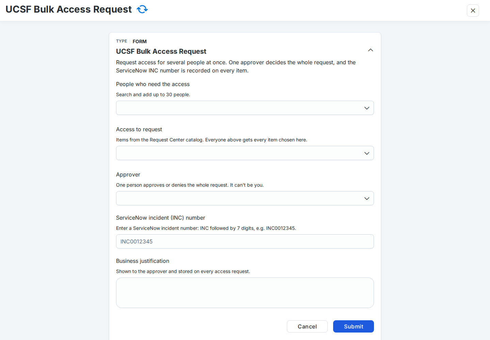
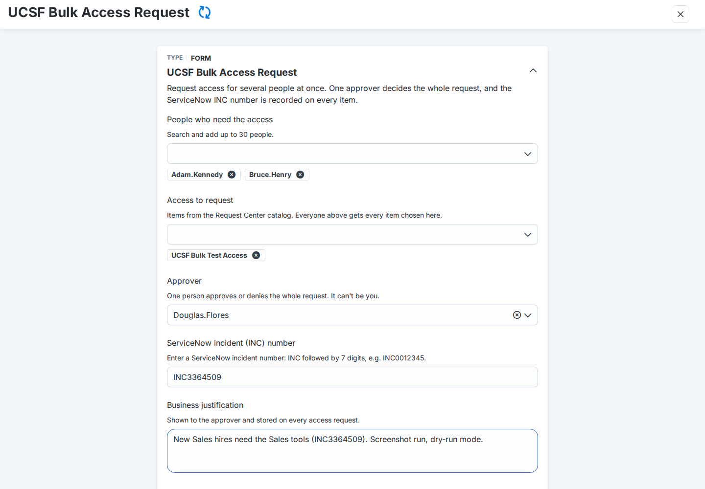
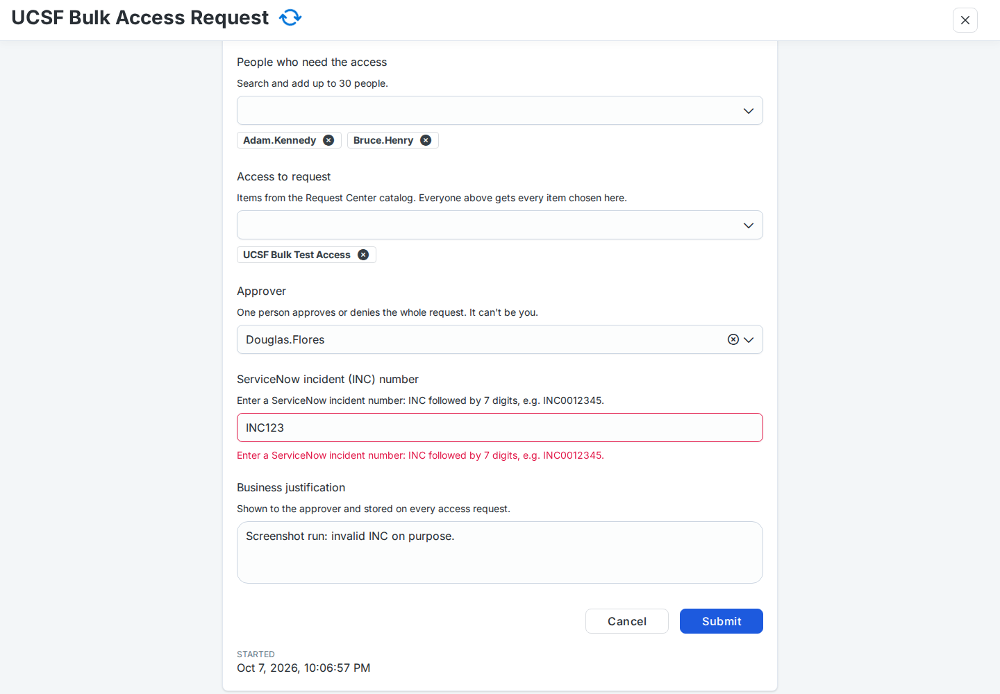

# Using Bulk Access Request

Guides for requesters, approvers and admins, following one bulk request from start to finish. The screenshots are real
SailPoint screens from a test installation that used the prefix `UCSF` (yours show your own prefix); they live in
[docs/screenshots/](docs/screenshots/). For the same lifecycle with the APIs and ISC features behind each step, see
[docs/sailpoint/END_TO_END_WALKTHROUGH.md](docs/sailpoint/END_TO_END_WALKTHROUGH.md).

| Step | Who | Where |
|---|---|---|
| [1. Get access to the tool](#1-get-access-to-the-tool-once) (once) | Requester | Request Center |
| [2. Submit a bulk request](#2-submit-a-bulk-request) | Requester | The plugin, or the Launchpad form |
| [3. Approve the bulk request](#3-the-bulk-approver-isc-approvals--other) | The one approver chosen | ISC **Approvals → Other** |
| [4. Approve the items](#4-item-approvers-owners-managers) | Each item's approvers (owner, manager, …) | The plugin's **Approvals** tab, or ISC **Approvals → Access Requests** |
| [5. Follow it](#5-tracking-my-bulk-requests-and-the-request-center) | Requester | The plugin's **My bulk requests** |
| [6. Emails](#6-emails-youll-get) | Requester, copied to the bulk approver | Your inbox: each email says what, why, and where to go next |

## 1. Get access to the tool (once)
Everyone who submits bulk requests, from the plugin or from the Launchpad, needs the access profile
**"<prefix> Bulk Access Request - Launcher Access"**. Approvers need nothing extra.

1. In the **Request Center**, search for *<prefix> Bulk Access Request*, select **Launcher Access**, **Continue**, add a
   comment and **Submit Request**.

   
2. It's approved automatically, or by your manager, depending on how your admin set it up (`access.launcherApproval`).
   **Request Center → My Requests** shows it as **Completed** once granted.

   
3. About a minute later the Launcher appears in your **Launchpad**, and the plugin can submit for you. Until then, a
   submit from the plugin stops with *"To submit, you need '<prefix> Bulk Access Request - Launcher Access'. Request it
   in the Request Center."* and nothing is sent.

   

## 2. Submit a bulk request
### From the plugin
Open **<prefix> Bulk Access Request** from the nav bar, or the plugin link your admin gave you. You don't need to be an
admin: the plugin fills in and submits the Launcher's form for you, so the approval and the requests carry your name.
(If your admin set the plugin up without the Launcher, only ORG_ADMIN users can submit, and the page says so.)

1. **People.** Search, or paste a list of usernames, emails or identity IDs (one per line). There's no upper limit
   unless your admin set one.

   
2. **Access.** Pick one or more items from the Request Center catalog. *Everyone* gets *every* item chosen here.

   
3. **Approver and INC.** One approver (not you, and not anyone on the people list), the ServiceNow INC number, a
   justification, and how long the access should last: **Permanent**, **for a duration** (a whole number and hours, days,
   weeks or months) or **until a date** (the end of that day, your local time). Your admin may turn some of these off,
   or cap how long temporary access can last.

   
4. **Review and submit.** The review says how many access requests SailPoint will file and how long the access lasts.
   **Submit for approval**.

   
5. The page then shows **"Waiting for <approver>"** and follows the approval.

   

**Big lists are sent in parts.** One approval can cover at most 250 people (your admin may set fewer). Above that, the
review step shows how the list will be split, and submitting sends one approval per part. Every part has the same INC,
items, approver, justification and access type. The approver sees one task per part, named `Bulk access INC0012345 (2/3)`.
Submitted through the Launcher, an end date reaches the approver as a number of hours (`Temporary: 720h`).
(These two screens use demo data.)

| Temporary access | Review with parts |
|---|---|
|  |  |

**When temporary access starts counting.** A duration counts from when the access is requested, which happens after
the approval. The plugin turns an end date into a number of hours when you submit, so a slow approval moves the end
later by about the same time.

### From the Launchpad form
**Launchpad → "<prefix> Bulk Access Request"** → **Launch**. A form opens:

| Field | What to enter |
|---|---|
| **People who need the access** | Add up to 30 people. **Type the full username** (e.g. `Adam.Kennedy`): the picker only matches complete usernames. You can also scroll the list. |
| **Access to request** | One or more items. *Everyone* above gets *every* item chosen here. |
| **Access type** | **Permanent** (the default) or **Temporary**. Only shown if your admin turned temporary access on. |
| **Duration** and **unit** | For temporary access: a whole number of 1 or more, and hours, days, weeks or months (your admin may offer fewer units). |
| **Approver** | The one person who decides. It can't be you, or anyone on the people list. |
| **ServiceNow incident (INC) number** | For example `INC0012345`. The form won't submit until the format is right. |
| **Business justification** | Shown to the approver and stored on every request |

| Filled in | A bad INC can't be submitted |
|---|---|
|  |  |

**Submit.** The Launchpad shows *"Sent to <approver> for approval."* If the duration isn't valid (not a whole number, or
longer than your admin allows), the Launchpad says so and no approval is sent.

## 3. The bulk approver: ISC Approvals → Other
The approver you chose gets **one** approval per bulk request (or per part of a large one), and an email if notifications
are on. It's a *generic* approval, so in ISC it's under **Approvals → Other**, not under *Access Requests*:

- The card is titled **"Grant: Bulk access INC…"**, with the requester as both *Requested by* and *Recipient*.

  
- Opening it shows only the requester's comment, **"INC…: justification"**. ISC doesn't show the people, the items or
  the access type here; the *Waiting for approval* email you're copied on lists them (section 6).
- Add a comment if you like, then **Approve** or **Deny**. **Approve acts immediately**: ISC asks for no confirmation.

  
- **Approve:** everyone on the request (or part) is requested every item, as normal access requests (in `live` mode;
  in `dry-run` nothing is requested). **Deny:** nothing is requested. Either way the requester gets an email.
- **Parts.** A large plugin request arrives as several approvals with the same INC, named `Bulk access INC0012345 (1/3)`,
  `(2/3)` and `(3/3)`. Each covers different people and is decided on its own.
- Approving doesn't skip the items' own approvals: each access request still goes to the item's approvers (step 4).
- The approval expires after the configured number of days (7 by default). Decided approvals are listed under
  **Other → Reviewed**; search for the INC.

## 4. Item approvers (owners, managers)
Each access request the bulk approval filed goes through the item's own approval scheme, **one approval per person**:
a bulk request for 300 people with an item you own gives you 300 approvals. They can arrive a minute or two apart.

### In ISC: Approvals → Access Requests
One card per person. *Requested by* is the **workflow owner** (the admin account the tool was installed with), not the
requester, because the workflow files the requests. The card is titled **"Grant: <item>"**, or **"Modify: <item>"** when
the person already has the item and only its end date changes. The comment carries the INC, the requester, the bulk
approver, the access type and the justification:
`INC0055504 | Bulk access request by … | Approved by … | Temporary: 1d | …`.

| One card per person | The comment carries the INC |
|---|---|
|  |  |

### In the plugin: the Approvals tab
Open the **<prefix> Bulk Access Request** plugin and its **Approvals** tab to decide a whole bulk request at once. Any
approver can use it, admin or not (your admin must have made the plugin visible to you).

1. Each card is one bulk request: the **INC**, how many approvals, people and items, the access (permanent or temporary),
   who asked for it and who approved the bulk request.

   
2. Open a card to check the list. Untick anyone you don't want to decide now; they stay pending. Write one comment
   (needed to deny), then **Approve N** or **Deny N**.

   
3. Confirm. The dialog repeats the INC and the counts. You can only act on one INC at a time.

   
4. A progress bar shows the decisions going out (about 8 a second); each is then re-read, so "approved by you" only counts
   confirmed decisions. The result says **Approved** (or **Denied**) only when every one is confirmed as yours; otherwise
   **Decided** (some by someone else, such as a colleague in the same approval group), **Partly done** or **Not done**.
   **Retry** sends the failed and still-pending ones again.

   

   With many approvals (demo data):

   | Decisions going out | Partly done, with Retry |
   |---|---|
   |  |  |

Every decision is recorded as **yours**, exactly as if you had used SailPoint's Approvals page, and appears under
**Approvals → Access Requests → Reviewed**. Approvals that didn't come from a bulk request may be listed under *Other*
(if your admin turned that on); decide those in SailPoint as usual.

## 5. Tracking: My bulk requests and the Request Center
**Use the plugin's My bulk requests tab.** It lists everything you submitted, grouped by INC (filter by INC at the top):
who decides, the decision and when, and the parts of a split request together.

| Waiting for the approver | Approved |
|---|---|
|  |  |

**Why your Request Center doesn't list the item requests.** The access requests are filed by the workflow, so SailPoint
files them under the **workflow owner** (the admin account the tool was installed with), not under you. Your
**Request Center → My Requests** therefore shows only your own requests, such as the Launcher Access one:

| Who | What they see |
|---|---|
| **Requester** | Plugin → My bulk requests: the bulk approval's status, plus the approved or denied email. Only administrators can list the item requests, so a non-admin sees the approval and the note *"Filed by the workflow on everyone's behalf, so only administrators can list them…"*. Signed in as the workflow owner, the tab also lists every access request with its status and, for temporary access, **Temporary until …**. |
| **Workflow owner** (admin) | Request Center → My Requests: every item request, one per person, with the INC in its comment. **Completed** once provisioned; **Pending** while a source still needs manual work (for example a manual work item on a disconnected source). |
| **Bulk approver** | Approvals → Other → Reviewed (search for the INC). |
| **Item approvers** | Approvals → Access Requests → Reviewed, or the plugin's Approvals tab while pending. |

Temporary access is removed by SailPoint on its remove date, with no further action.

## 6. Emails you'll get
Every email has the same layout: **What** (the INC and part, each item with its type, how many people, permanent or
temporary), **Why** (the justification and who asked), the **Decision** once there is one (approver, who acted, their
comment), and **What happens next** or **What to do now**, with links into your tenant. A **Need help?** line at the
bottom says whom to ask (`notifications.helpContact`). The requester gets them; the bulk approver is copied on the first
three (`notifications.ccApprover`).

| Email | When | Where it points |
|---|---|---|
| **Waiting for approval** | The request reached the bulk approver (`notifications.pendingEmail`) | The approver decides in ISC **Approvals → Other** (task *Grant: Bulk access INC…*); Approve there acts immediately. Says when it expires. The requester follows it in the plugin's **My bulk requests**. |
| **Approved** | The bulk approver approved | Items with their own approval still need it per person: item approvers use ISC **Approvals → Access Requests** or the plugin's **Approvals** tab. The item requests are filed by the workflow, so they're not in your Request Center; follow them in **My bulk requests**. |
| **Not approved** | Denied, or expired after the configured days | The approver's comment, then how to resubmit: the plugin (New request tab) or **Launchpad → "<prefix> Bulk Access Request"**. The same INC is fine. |
| **Not sent for approval** | The workflow stopped the request before any approval (you chose yourself or one of the people as approver, a bad INC, a bad duration or unit) | The field to fix, what was entered, and where to submit again. Nothing was requested. The Launchpad (or the plugin) shows the same message at once. |

In `dry-run` mode every email carries a **DRY RUN** banner: nothing is ever requested. With
`notifications.overrideRecipients` set (test tenants), all of them go to those addresses instead.

## Admins
- **Install, update, uninstall:** see [INSTALL.md](INSTALL.md). Everything is set in one file, `config/<tenant>.json`.
  - Check health: `python bulkaccess.py status --config …`.
  - After any config change, or when the catalog changes: `python bulkaccess.py apply --config …`.
- **Who can use it:** whoever holds the *Launcher Access* profile. It's an ordinary access profile, so it shows up in
  certifications too, and people request it in the Request Center (auto-approved with `access.launcherApproval: "NONE"`,
  else by their manager). Submitting from the plugin needs the same profile when it submits through the Launcher
  (`plugin.submit: "launcher"`, the default with both deployments), or ORG_ADMIN with `plugin.submit: "test-endpoint"`.
  Either way, people must be able to see the plugin (make it public, or add them to its `restrictToUsers`); its Approvals
  tab works for any item approver who can see it. Bulk approvers and item approvers need nothing extra.
- **The workflow owner is the requester of every item request** (`owner` in the config, or the installer's PAT user).
  Item approvers see that account as *Requested by*, and its Request Center lists every request. A dedicated service
  identity that owns and approves no items keeps this tidy.
- **Approvals tab** (`approvals` in the config): on by default. `concurrency`, `useBulkEndpoint` (`auto` = SailPoint's bulk
  endpoint for ORG_ADMIN only; it refuses everyone else), `maxRows`, `showOther` and `denyCommentRequired`.
- **Temporary access** (`temporaryAccess` in the config): turn it on or off, choose the units, allow end dates (plugin
  only), and cap the length with `maxDays`. It ends automatically on the remove date, and SailPoint removes it with no
  further action. The remove date is visible on each access request.
- **Audit:**
  - Every request made by the tool has this comment:
    `INC… | Bulk access request by <requester> | Approved by <approver> | <access> | <justification>`,
    where `<access>` is `Permanent` or `Temporary: …`. The INC always comes first.
  - The approval decisions are in the generic approvals history. Parts share the INC, so search for it to find them all.
  - Each run is in **Admin → Workflows → "<prefix> Bulk Access Request" → Execution History** (the plugin's runs are
    there too when it submits through the Launcher, or under "<prefix> Bulk Access Request (Plugin)" with the test endpoint).
- **Test safely:**
  - Keep `"mode": "dry-run"` until you've run `launcher/e2e.py` on test identities.
  - In shared or test tenants, set `notifications.overrideRecipients` so emails don't reach real people.
