# End-to-end walkthrough: one bulk request on a real tenant

**For SailPoint and platform teams.** One bulk request followed from start to finish: who acts, where in ISC, what they
see, and which ISC feature or API call does the work. Recorded on 2026-10-08 on a live test tenant in `live` mode, with
test identities only and a harmless test access profile; the installation used the prefix `UCSF`, so yours shows your own.
The recording is `bulk-access-real-e2e.mp4` on the GitHub release `demo-2026-10-09`.

Related: [API_INVENTORY.md](API_INVENTORY.md) (every call, with user levels and scopes) ·
[REQUIREMENTS_CHECKLIST.md](REQUIREMENTS_CHECKLIST.md) (what to check in a tenant first) ·
[USAGE.md](../../USAGE.md) (the same steps, written for end users).

## The cast
| Role | In the recording | User level | Needs |
|---|---|---|---|
| **Requester** | `bulk.requester.test` | User (not an admin) | The *"<prefix> Bulk Access Request - Launcher Access"* profile, and to see the plugin |
| **Bulk approver** | `bulk.approver.test` | User | Nothing |
| **Item approver** (owner of the test access profile) | `bulk.approver.test` | User | Nothing (to see the plugin, for its Approvals tab) |
| **People** getting the access | Two test identities | — | — |
| **Workflow owner** | The admin who installed the tool (the PAT user) | ORG_ADMIN | Already set up by the installer |

The request: 2 people × 1 access profile, **temporary for 1 day**, INC `INC0055504`, deployment A (Launcher) and B
(plugin, `plugin.submit: "launcher"`) installed side by side.

## At a glance
| # | Who | Where | ISC feature | Main API calls |
|---|---|---|---|---|
| 1 | Requester | Request Center | Access request for a requestable access profile | ISC's own |
| 2 | Requester | Launchpad | Launcher (`assignedLaunchers` entitlement) | ISC's own |
| 3 | Requester | The plugin | UI plugin, Launcher, interactive form | `public-identities`, `requestable-objects?identity-id=`, `launchers/{id}/launch`, `/beta/interactive-processes/{id}/blocks`, `form-instances/{id}` |
| 4 | Workflow | — | Workflow: form → checks → generic approval | `sp:interactive-form`, `sp:compare-strings`, `sp:generic-approval` |
| 5 | Bulk approver | Approvals → **Other** | Generic approval | ISC's own (`generic-approvals/{id}/approve`) |
| 6 | Workflow | — | Loop → Manage Access v2 (as the workflow owner) | `sp:loop:iterator`, `sp:access:manage` v2 |
| 7 | Item approver | Approvals → **Access Requests**, or the plugin's Approvals tab | Access-request approvals (one per person) | `generic-approvals?mine=true`, `generic-approvals/{id}/approve` |
| 8 | Everyone | Plugin *My bulk requests*, Request Center *My Requests*, Approvals *Reviewed* | — | `generic-approvals?requesterId=`, `access-request-status?requested-by=` |

## 1. The requester gets Launcher Access (once)
**Who:** the requester. **Where:** Request Center.

The installer created the access profile *"<prefix> Bulk Access Request - Launcher Access"*. It wraps the
`assignedLaunchers` entitlement that ISC auto-creates for the Launcher on the IdentityNow source, and it's requestable.
The requester finds it in **Request Center → Find Access**, selects it, adds a comment and submits.

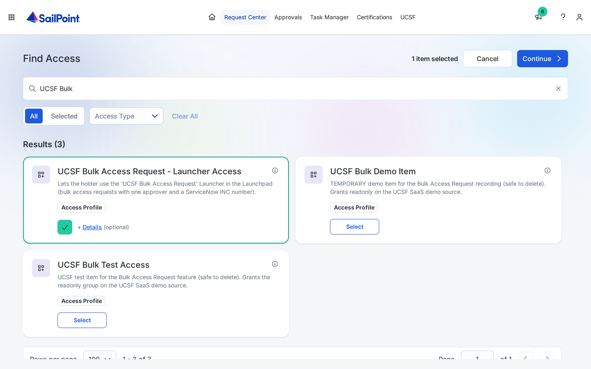

It's **auto-approved** when `access.launcherApproval` is `NONE` (as in the recording), otherwise it goes to the
requester's **manager**. **Request Center → My Requests** then shows *Grant: … Launcher Access* as **Completed**.

**Without it**, the plugin can still be opened, but a submit stops with *"To submit, you need '<prefix> Bulk Access
Request - Launcher Access'. Request it in the Request Center."* (the launch call answers 401/403, or 500 "insufficient
authorization").

## 2. The Launcher appears in the Launchpad
**Who:** the requester. **Where:** Home → Launchpad.

About a minute after the grant, the Launcher *"<prefix> Bulk Access Request"* is listed in the Launchpad. Launching it
there opens the native form (up to 30 people). The plugin uses the same Launcher, so the same profile controls both.

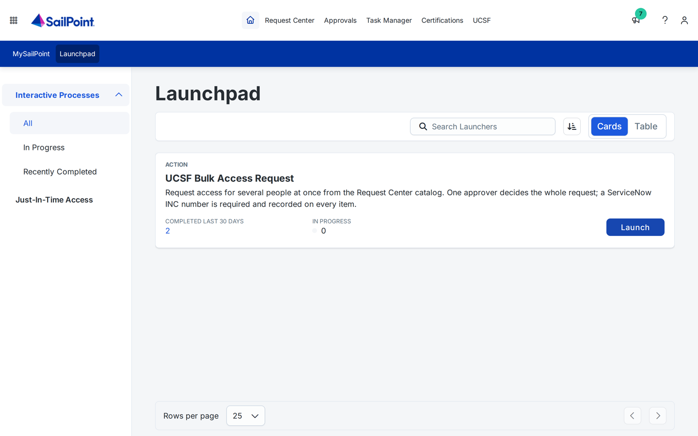

## 3. The requester submits from the plugin
**Who:** the requester (not an admin). **Where:** the *<prefix> Bulk Access Request* UI plugin, inside ISC.

| Step | What they do | Calls (as the signed-in user) |
|---|---|---|
| People | Search by name, or paste usernames, emails or IDs | `GET /v3/public-identities` (non-admins); admins use identities, search and accounts |
| Access | Pick from the Request Center catalog | `GET /v3/requestable-objects?identity-id=<me>&types=…`, `GET /v2025/entitlements?filters=requestable eq true` |
| Approver and INC | One approver, the INC (checked against the configured pattern), a justification, *For a duration: 1 day* | — (rules run in the page) |
| Review | Checks "already has it" for access profiles and roles | `GET /v3/requestable-objects?identity-id=<person>&filters=id in (…)` |

| People | Access |
|---|---|
|  |  |
| **Approver and INC** | **Review** |
|  |  |

**Submit for approval** then drives the Launcher for the user, once per part (here one part):

1. `POST /v2025/launchers/{launcherId}/launch` `{}` → `interactiveProcessId`. Allowed because the user holds the
   Launcher's `assignedLaunchers` entitlement.
2. `GET /beta/interactive-processes/{id}/blocks`, polled every second (up to 30 s), until the `FORM` block names the
   form instance. This is the same **beta** call ISC's Launchpad makes; see the risk in
   [API_CONTRACT_ALIGNMENT.md](API_CONTRACT_ALIGNMENT.md#5-risks-and-what-to-watch).
3. `PATCH /v2025/form-instances/{id}` with the people, items, approver, INC, justification, access fields and the part
   label, then `/state` = `SUBMITTED` (it may take two PATCHes: ASSIGNED → IN_PROGRESS → SUBMITTED).

The page then shows **"Waiting for <approver>"**, with the workflow execution and the approval ID. It follows the
approval through `GET /v2025/generic-approvals?requesterId=<me>` (a query parameter; the `filters=` form returns nothing
for non-admins).

**Who is the requester?** SailPoint takes it from the session that submitted the form, so the approval and every
request's comment carry the signed-in user's name; it can't be faked from the page.

## 4. The workflow checks the request and creates one approval
**Who:** the workflow *"<prefix> Bulk Access Request"* (triggered by `idn:interactive-process-launched`, filtered to its
own Launcher). It checks that the approver isn't the requester or one of the people, that the INC matches the pattern,
and that the duration is valid, then creates **one** generic approval (`sp:generic-approval`, `approvalType SINGLE`,
assigned to the chosen identity) named **"Bulk access INC0055504"** (with `(k/n)` for parts). A failed check ends the run
with a message in the process, which the plugin shows; nothing is requested.

## 5. The bulk approver decides in ISC Approvals → Other
**Who:** the bulk approver. **Where:** Home → Approvals → **Other** (generic approvals are not under *Access Requests*).

- The card is titled **"Grant: Bulk access INC0055504"**; *Requested by* and *Recipient* are both the requester.

  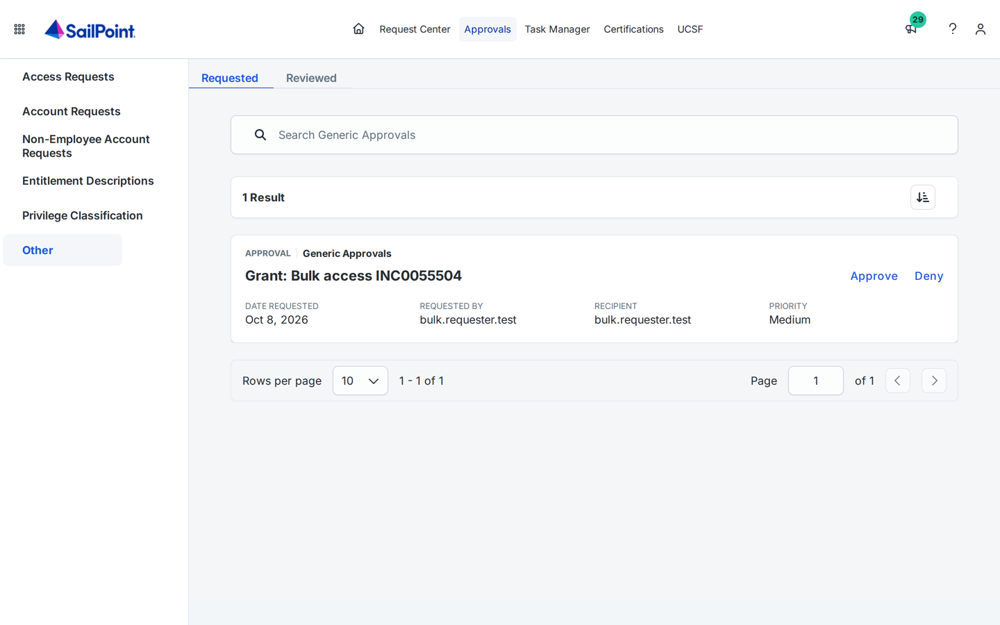
- The drawer shows only the comment **"INC0055504: <justification>"**. ISC doesn't show the people, the items or the
  access type here.
- **Approve acts immediately**: ISC asks for no confirmation. Afterwards it's under **Other → Reviewed** (search for the
  INC).

  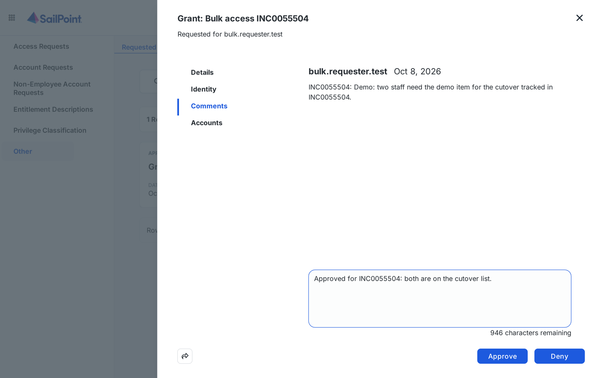

An ORG_ADMIN can also decide on the approver's behalf (`POST /v2025/generic-approvals/{id}/approve|reject`), recorded as a
manual reassignment.

## 6. The workflow requests the access, as its owner
**Who:** the workflow. On **APPROVED** (and in `live` mode), `sp:loop:iterator` runs once per person (≤ 250, in parallel),
and `sp:access:manage` v2 files one access request per person carrying **all** the items, with `removeDuration` (`1d`
here; `""` = permanent) and the comment
`INC0055504 | Bulk access request by bulk.requester.test | Approved by bulk.approver.test | Temporary: 1d | <justification>`.

These requests are filed by the **workflow owner** (the installer's PAT user, or the configured `owner`), not by the
requester. That decides who sees them where (section 8). The requester and the approver get an email.

## 7. Item approvers decide, in ISC or in the plugin
**Who:** each item's approvers (here the test profile's owner). Item approval schemes still apply: **one approval per
person and item**. A second person's approval can arrive **1–2 minutes** after the first.

**In ISC, Approvals → Access Requests:** one card per person. *Requested by* is the **workflow owner**. The title is
**"Grant: <item>"**, or **"Modify: <item>"** when the person already had the item and only the end date changes (as in
the recording, where both people already had it; the drawer then reads *Access Date Change*). The comment carries the
INC, requester, bulk approver, access type and justification.

| One card per person | The comment carries the INC |
|---|---|
| 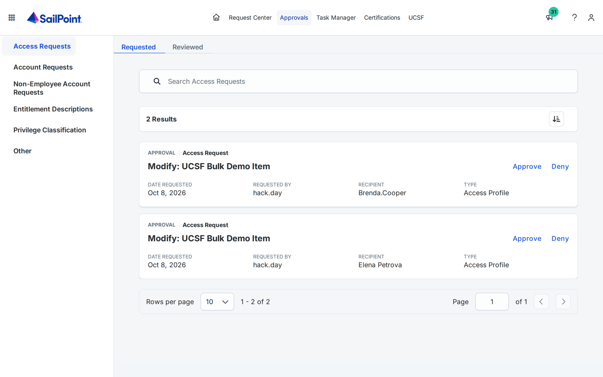 | 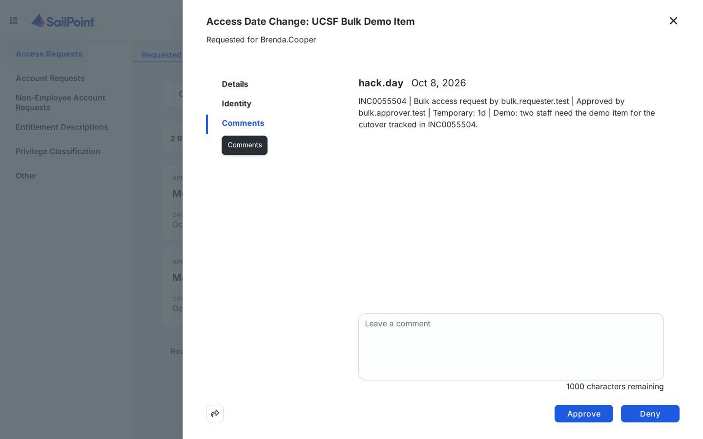 |

**In the plugin's Approvals tab:** the approver's pending access-request approvals, grouped by the INC in their comment
(`GET /v2025/generic-approvals?mine=true&include-comments=true&filters=status eq "PENDING" and type eq "ACCESS_REQUEST_APPROVAL"`).
One comment and one confirmation decide the whole INC; each approval is sent as the approver's own decision
(`POST /v2025/generic-approvals/{id}/approve`, about 8 a second) and then re-read to confirm it.

| The INC waiting | Opened: 2 people, 1 item |
|---|---|
|  | 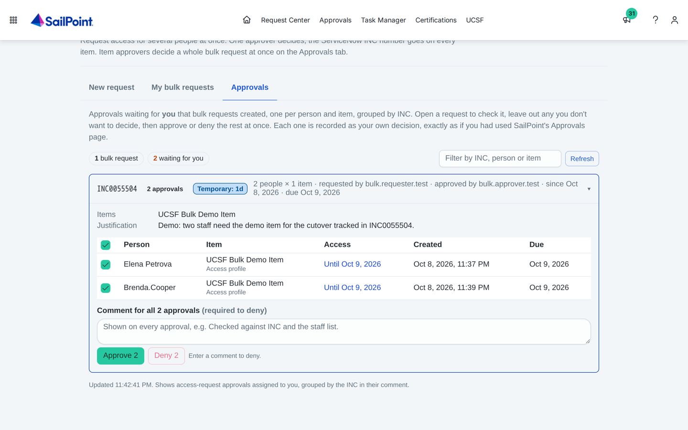 |
| **Confirm** | **Result** |
| 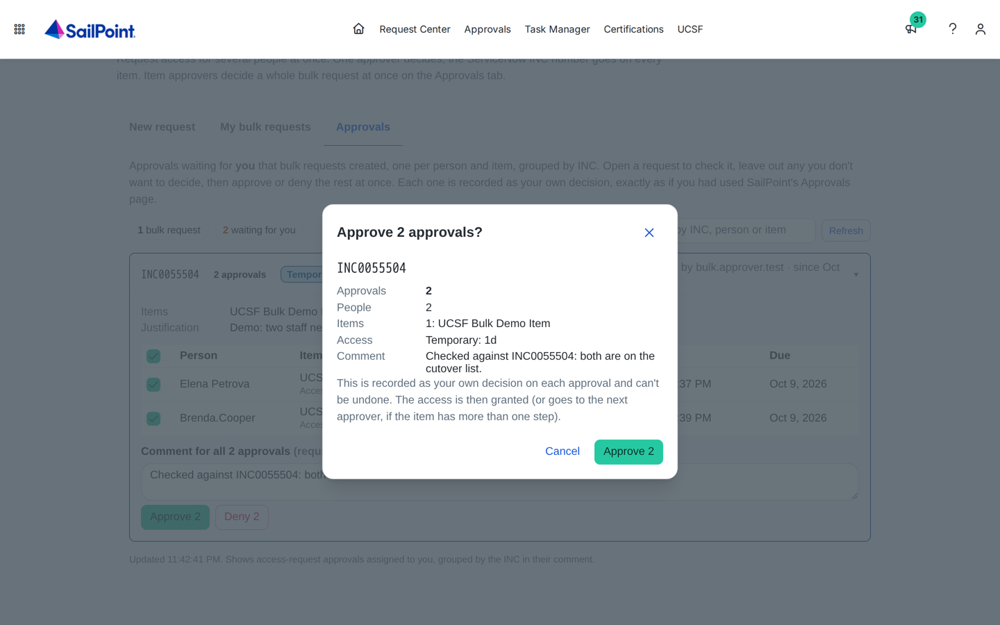 |  |

The decisions are recorded exactly as if made in ISC's Approvals page, and appear under **Access Requests → Reviewed**.

## 8. Request Center before and after approval
The item requests belong to the **workflow owner**, so each person sees a different picture:

| Who | Before the bulk approval | After the bulk and item approvals |
|---|---|---|
| **Requester** | Plugin *My bulk requests*: **Waiting for approval**. Request Center *My Requests*: only their own requests (Launcher Access) | Plugin *My bulk requests*: **Approved**, by whom and when. Only administrators can list the item requests, so a non-admin sees a note instead. Request Center *My Requests*: still **no item requests**. Plus the approval email |
| **Bulk approver** | Approvals → Other: **"Grant: Bulk access INC…"** pending | Approvals → Other → Reviewed: **Approved** |
| **Item approvers** | Nothing yet (the requests don't exist until the bulk approval) | Approvals → Access Requests: one card per person, then Reviewed. Plugin Approvals tab: the INC, then nothing waiting |
| **Workflow owner** (admin) | Nothing | Request Center *My Requests*: one request per person, with the INC in the comment. **Completed** once provisioned, **Pending** while the source needs manual provisioning (in the recording, one person's account was on a source with a manual work item) |

| Requester: My bulk requests, waiting | Requester: My bulk requests, approved |
|---|---|
| 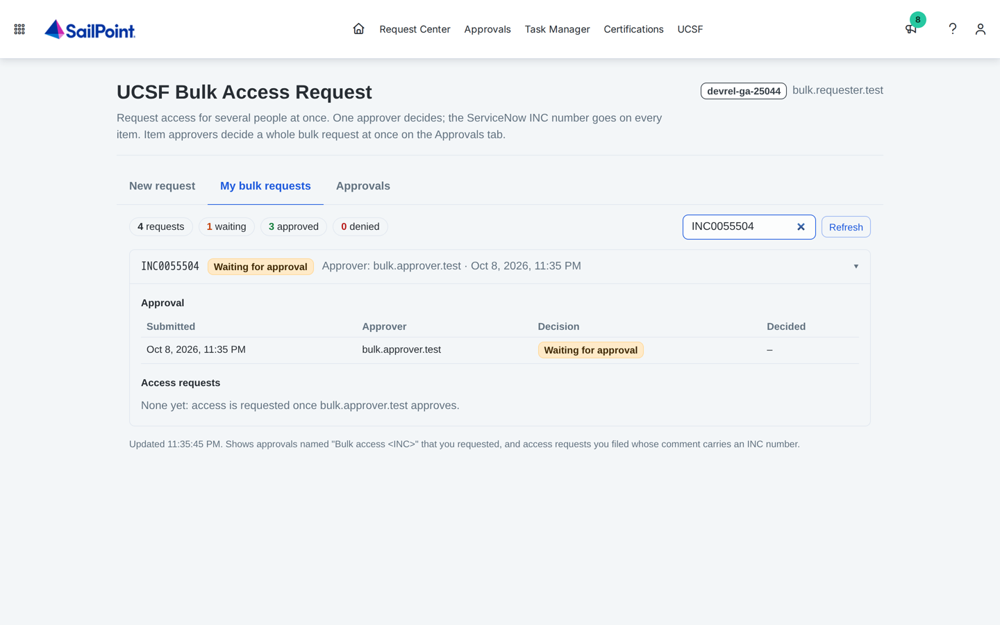 |  |
| **Requester: Request Center, no item requests** | **Workflow owner: Request Center, Completed and Pending** |
| 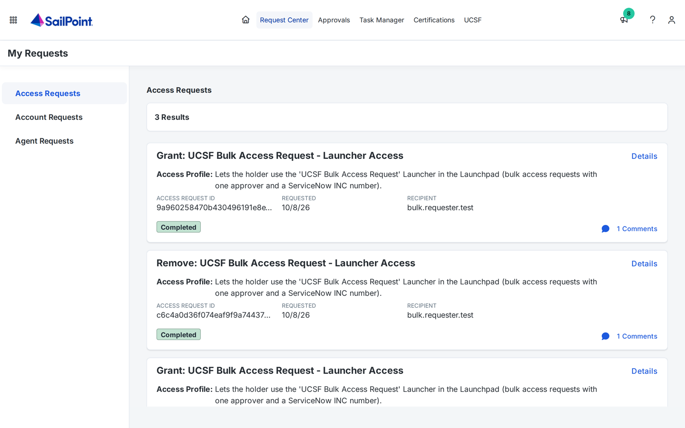 | 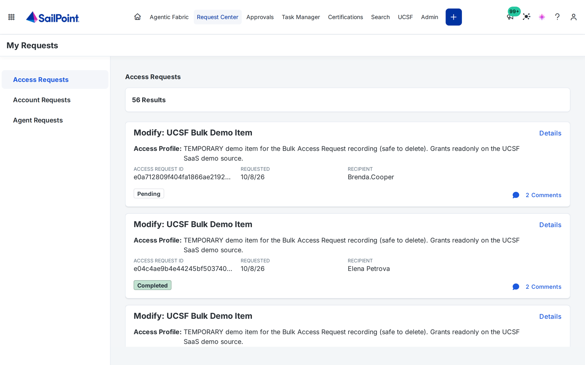 |

**What this means for a rollout:** tell requesters to follow their requests in the plugin's *My bulk requests*, not in
the Request Center. For audit, search the INC: it's on the generic approval's name, on every access request's comment,
and in the workflow's execution history. A dedicated service identity as `owner` keeps the workflow owner's Request
Center (and the item approvers' *Requested by*) separate from a real admin's.

### The emails at each step
The requester gets each email, and the bulk approver is copied on the first three (`notifications.ccApprover`). Each says
what was asked (INC and part, every item with its type, how many people, how long), why (justification, requester), the
decision when there is one, and where to go next, with links built at install time (`config.ui_base_url`: the
`SAIL_BASE_URL` host without `.api.`, or `notifications.uiBaseUrl`; the plugin's ID from `GET /ui-plugins/v1/resolve-alias`).

| Step | Email (`sp:send-email` v2) | Points to |
|---|---|---|
| 4, check failed | *Not sent for approval: …*: the field to fix and the value entered | Plugin (New request tab), or Launchpad `/ui/d/launchpad` |
| 4, approval created | *Waiting for approval: bulk access INC…* (`notifications.pendingEmail`) | Approvals → Other `/ui/d/approvals/other/requested-items`; plugin *My bulk requests* `/ui/plugin/<id>` |
| 6, approved | *Approved: bulk access INC…* | Approvals → Access Requests `/ui/d/approvals/access-request/requested-items` and the plugin's Approvals tab for item approvers; *My bulk requests* |
| 5, denied or expired | *Not approved: bulk access INC…*, with the approver's comment | Plugin (New request tab), or Launchpad |

## 9. Temporary access ends on its own
The requests carry `removeDate` (+1 day here). SailPoint removes the access then, with no further action; the plugin's
*My bulk requests* shows **Temporary until …** on each request it can list.
